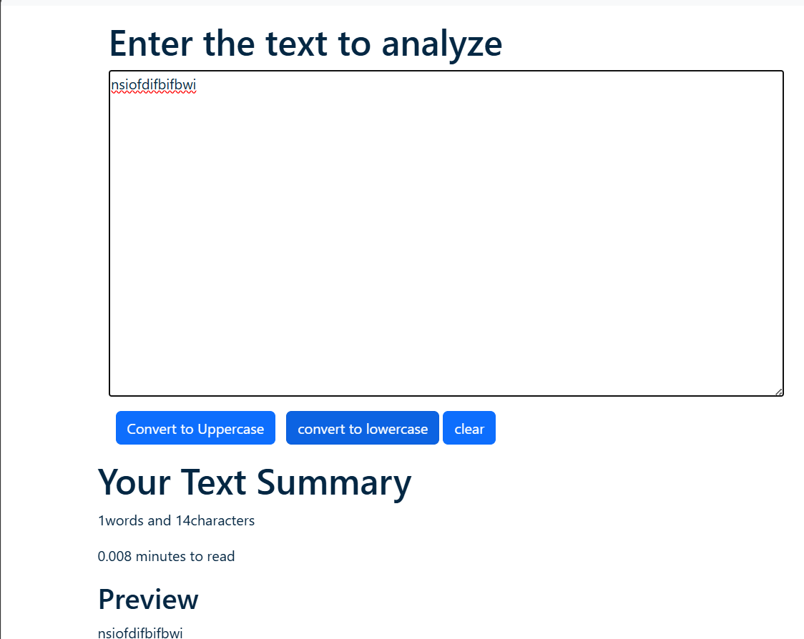
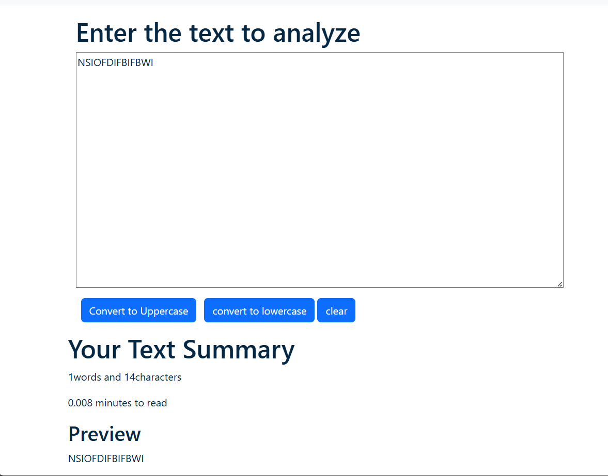

# Gboard Project
## Project Description 
### The Text Transformer is a React-based web application designed for efficient text manipulation. It allows users to convert text between uppercase and lowercase, clear the input field, copy text to the clipboard, and paste content seamlessly. With a clean and user-friendly interface, the tool provides real-time updates and smooth functionality, making it ideal for quick formatting tasks. Built using React.js, it showcases a component-based architecture and clipboard integration for enhanced usability. This project is perfect for developers, writers, or anyone needing fast and simple text editing solutions.

## Steps to run this project on your local environment : 
- **1.Download all the attachment from the repository "Gboard".**
- **2.Extract the Gboard File.**
- **3.Open in VS Code and open the terminal.**
- **4.Install the dependencies using command "nmp install".**
- **5.Use command "npm start" to start the react app.**

## Description of the Files
- **'public' : Contains static assets like index.html and other files directly served to the browser without processing by Webpack or React.**
- **'src' : Holds the source code of your React application, including components, styles, and logic.**
- **'.gitignore' : Specifies files and directories for Git to ignore, preventing unnecessary files (like node_modules/) from being committed.**
- **'README.md': Provides documentation and instructions for your project, typically explaining how to set up and run the application.**
- **'package-lock.json' : Locks the exact versions of installed dependencies, ensuring consistent builds across environments.**
- **'package.json': Contains metadata about your project (name, version, etc.), lists dependencies, and defines scripts like npm start.**

## Input of the application

## Output of the application

## Deliverables :
This application successfully converts Uppercase to Lowercase and vice versa.
